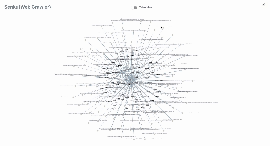

### Crawler UI

User interface to visualize the crawled sites by fetching data from Neo4j.

The user interface is built with ReactJS and uses CytoScapeJS to display graph in an interactable form. It displays the knowledge of the crawled sites in two modes: *Table* and *Graph*

In graph mode you can see the links and visited timings with the references, the driver helps to fetch the data in realtime and display in interactable form.
In the table mode we can view the data in an organised numerical way which shows the number of indegree and outdegree from a site and its main host.

#### Setup Instructions
- `cd senku && npm i`
- Include Neo4j credentials in .env like in sample.env
- npm run dev

